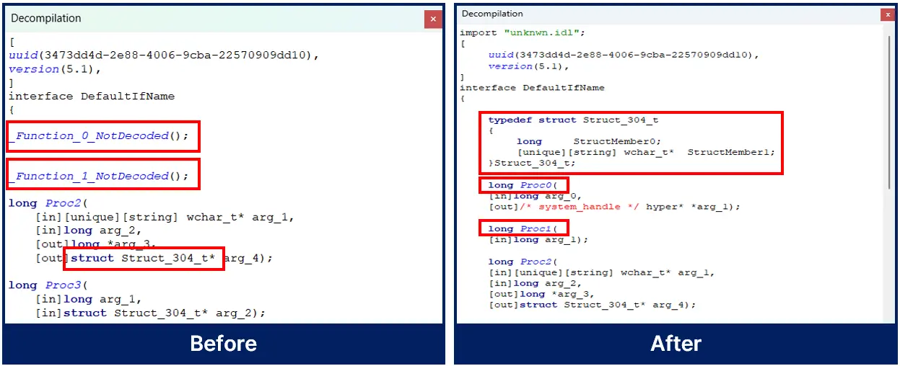
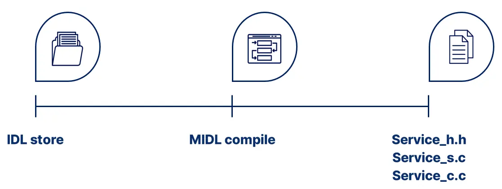



  <h1><code>RpcView
(BoB13-MSRC_GASAN)</code></h1>
  

    <strong>Enhanced RpcView</strong> 
    More decompiles possible, Representing a structure, automated IDL compile
  

  

    Derived from RpcView of silverf0x
  

  

    
  

## Overview
The existing RpcView has a problem where many of its interfaces are not decompiled.

Also, if even one method fails to decompile, it does not output the prototype of the structure used in the argument.

This repository has improved this part and added convenient features such as automated IDL compile.

---

## Improvements
### Solved the problem of method not being decompiled

- We **modified the part that prints the structure** when an error occurs because the method is not decompiled, so that **you can check the structure used in the argument**.
- We **restored certain data types** that were undefined(handled as errors) by referring to the standard, and **modified them to allow decompilation**.
- This fix allows decompiling interfaces that were not before, and allows compiling the IDL.

---

## Additional features
### Automated IDL Compile

- We **automated the compilation of IDL files**, reducing the inconvenience of having to upload them to Visual Studio and compile them one by one.
- To call an RPC method, client server header code compiled according to the IDL of the corresponding interface are required.
- Now, when you decompile the interface, it will automatically compile the idl and create the client server header code.

---

## Achievement
- We can extract more 1449 methods.
- If even one method cannot be decompiled, the structure cannot be decompiled, making analysis totally impossible.
Now, almost all cases can be decompiled.
- As a result, the time required for initial analysis and access attempts for vulnerability analysis can be dramatically reduced.
